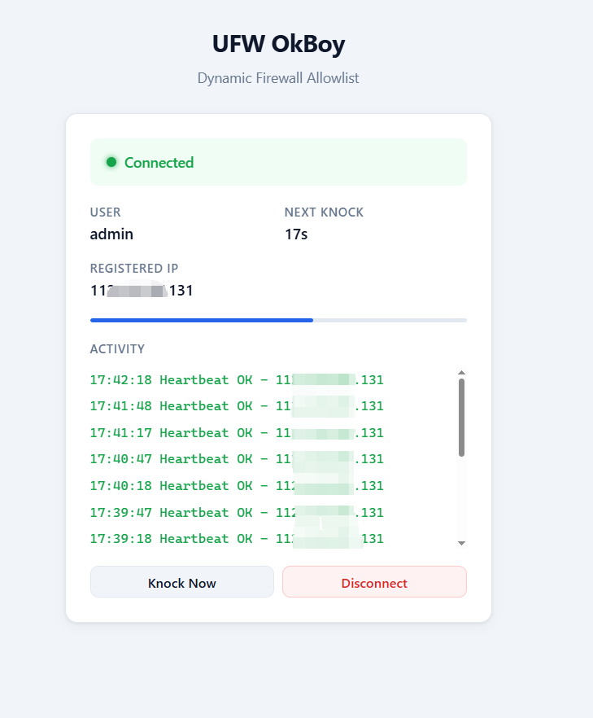

# UFW OkBoy

**Dynamic firewall allowlist manager** — automatically registers authorized clients' IP addresses in UFW when they authenticate, swaps rules seamlessly on IP change, and keeps the firewall clean and traceable.

English | [中文](README.md)

<p align="center">
  
</p>

---

## Why

Your server's sensitive ports (admin panels, databases, APIs) are behind UFW firewall rules that only allow specific IPs. But client IPs change — switching WiFi, traveling, restarting routers — and every change means bothering the admin to update the firewall manually.

**UFW OkBoy automates this**: users authenticate through a web page once, and the server updates the firewall automatically. When their IP changes, the next heartbeat swaps the rule seamlessly.

## How It Works

```
Client (Browser / Python / Shell)
    |
    | HTTPS + HMAC-SHA256 signed auth
    v
Nginx (reverse proxy, TLS, passes real IP)
    |
    v
Flask API (verify identity, extract client IP)
    |
    v
UFW (remove old rule → add new rule → comment: ufw-okboy:<username>)
```

## Key Features

| Feature | Description |
|---------|-------------|
| **Web client** | Open in browser, auto-knocks every 30s, auto-reconnects on reopen. Mobile friendly |
| **Clean rules** | One rule per user per port, old IP auto-replaced on change, no stale entries |
| **Traceable rules** | Each UFW rule tagged `ufw-okboy:<username>`, visible in `ufw status` |
| **Anti-sharing** | One IP per account — sharing credentials means mutual kicking; anomaly alerts on suspicious IP switching |
| **Auto-cleanup** | Rules for users inactive 7+ days purged by daily timer |
| **Secure auth** | HMAC-SHA256 + timestamp, secret never transmitted, HTTPS encrypted |
| **Three clients** | Web UI / Python script / Shell script (curl + openssl, zero deps) |

## Quick Start

**Server (admin):**

```bash
git clone https://github.com/lvusyy/UFW-OkBoy.git /opt/ufw-okboy
cd /opt/ufw-okboy
python3 -m venv venv && venv/bin/pip install -r server/requirements.txt
cd server
../venv/bin/python app.py gen-secret alice    # generate user secret
cp config.example.yaml config.yaml            # edit: set ports and secrets
sudo ../venv/bin/python app.py serve --debug   # start (dev mode)
```

**Client (user):**

Open `https://your-server.com/` in a browser → enter username and secret → click **Connect** → done.

## Documentation

See **[GUIDE.md](GUIDE.md)** for the complete deployment and usage guide (Chinese), covering:

- Server deployment (UFW prerequisites, Nginx, Systemd)
- Key generation and secure distribution workflow
- Client usage (Web / Python / Shell)
- Daily management (user CRUD, rule cleanup, troubleshooting)
- Security mechanisms and best practices
- FAQ

## Project Structure

```
server/
  app.py              Flask API + CLI (serve / gen-secret / list / cleanup / sync)
  ufw_ops.py          UFW operations + state persistence
  static/index.html   Web client (single-file SPA, no build step)
  config.example.yaml Configuration template
  requirements.txt    Dependencies
client/
  knock.py            Python client (stdlib only)
  knock.sh            Shell client (curl + openssl)
  config.example.yaml Client config template
nginx/
  ufw-okboy.conf      Nginx reverse proxy config
deploy/
  ufw-okboy.service   Systemd service (Gunicorn)
  ufw-okboy-cleanup.* Stale rule cleanup timer
  knock.*             Client auto-knock timer
  install-server.sh   Server install script
```

## License

MIT
